#Data Visualization

## Simple Plotting with Matplotlib

    
    
    import numpy as np
    
    X = np.linspace(-np.pi, np.pi, 256, endpoint=True)
    C, S = np.cos(X), np.sin(X)

    %pylab inline
    import matplotlib.pyplot as pl
    import pandas as pd

    Populating the interactive namespace from numpy and matplotlib

    plt.plot(X,C)

    [<matplotlib.lines.Line2D at 0x106aa48d0>]

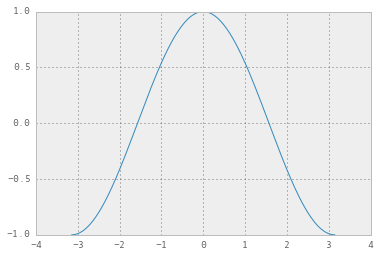

    plt.plot(X,S)

    [<matplotlib.lines.Line2D at 0x106bdf090>]

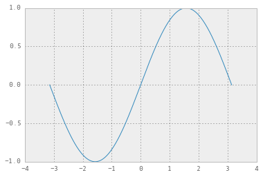

    plt.plot(X,C)
    plt.plot(X,S)

    [<matplotlib.lines.Line2D at 0x106bf5750>]

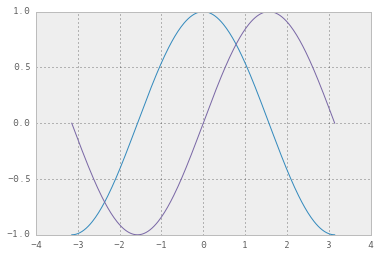

    # Create a figure of size 8x6 inches, 80 dots per inch
    plt.figure(figsize=(8, 6), dpi=80)
    
    # Create a new subplot from a grid of 1x1
    plt.subplot(1, 1, 1)
    
    X = np.linspace(-np.pi, np.pi, 256, endpoint=True)
    C, S = np.cos(X), np.sin(X)
    
    # Plot cosine with a blue continuous line of width 1 (pixels)
    plt.plot(X, C, color="blue", linewidth=1.0, linestyle="-")
    
    # Plot sine with a green continuous line of width 1 (pixels)
    plt.plot(X, S, color="green", linewidth=1.0, linestyle="-")
    
    # Set x limits
    plt.xlim(-4.0, 4.0)
    
    # Set x ticks
    plt.xticks(np.linspace(-4, 4, 9, endpoint=True))
    
    # Set y limits
    plt.ylim(-1.0, 1.0)
    
    # Set y ticks
    plt.yticks(np.linspace(-1, 1, 5, endpoint=True))
    
    # Save figure using 72 dots per inch
    # savefig("exercice_2.png", dpi=72)
    
    # Show result on screen
    plt.show()

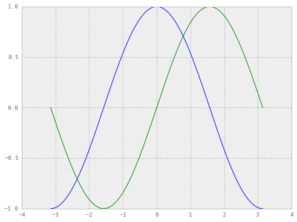

## Figures, Subplots, Axes and Ticks

* Figure = the whole window
* Subplot = Position Plots in a Grid
* Axes = Position plots anywhere
* Ticks = Representative Numbers

    # Subplot
    #fig.add_subplot(rows, cols, num)
    
    fig = plt.figure()
    for i in range(6):
        ax = fig.add_subplot(2, 3, i + 1)
        ax.set_title("Plot #%i" % i)

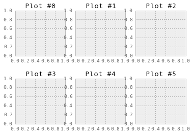

    # Axes
    pl.Figure(figsize=(10,10))
    pl.axes([0,0, 1, 1])  # Left, Bottom, Width, Height in Percentages
    pl.xticks(())
    pl.yticks(())
    pl.text(.6, .6, 'axes([0.1,0.1,.8,.8])', ha='center', va='center',
            size=20, alpha=.5)
    
    pl.axes([.2, .2, .3, .3])
    pl.xticks(())
    pl.yticks(())
    pl.text(.5, .5, 'axes([0.2,0.2,.3,.3])', ha='center', va='center',
            size=16, alpha=.5)
    

    <matplotlib.text.Text at 0x10857de50>

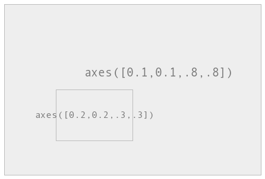

### Scatter Plots

    x = np.arange(50)
    y = np.random.randn(50)
    plt.scatter(x,y)

    fig = figure()
    a = randn(50).cumsum()
    
    # Two rows, one column, first plot
    ax1 = fig.add_subplot(2,1,1)
    ax1.plot(a, color='red')
    
    #Two rows, one column, second plot
    ax2 = fig.add_subplot(2,1,2)
    ax2.scatter(np.arange(50), randn(50))
    
    # Exercise: Try 1 row, two columns
    # Exercise: Try 1 row, one column

    fig, ax = plt.subplots(2,3)
    
    ax[0,1].plot(randn(50), color='green', linestyle='-')
    ax[1,2].scatter(np.arange(50), randn(50), color='red')
    ax[1,0].hist(randn(1000))

### Ticks, Labels and Legends

    fig = plt.figure(); ax = fig.add_subplot(1, 1, 1)
    ax.plot(randn(1000).cumsum(), 'k', label='one') 
    ax.plot(randn(1000).cumsum(), 'k--', label='two')
    ax.plot(randn(1000).cumsum(), 'k.', label='three')
    ax.set_title('Three random lines')
    ax.legend(loc='best')
    plt.show()
    
    #Exercise: Change the color and line style of each line using the minimum amount of characters
    # Exercise: Add text to the plot

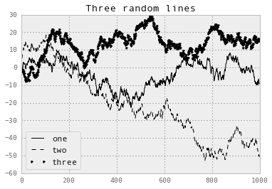

    

## Plotting with Pandas

    # Subplotting example
    a = randn(50).cumsum()
    b = randn(50).cumsum()
    c = randn(50).cumsum()

    df=pd.DataFrame({'a':a,'b':b,'c':c})

    df.plot(subplots=True)

    df.plot()

    df[0:20].plot(kind='bar')

### Using Pandas Groupings with Plots

    titanic = pd.read_csv("data/titanic.csv")

    

    SurvivedByClass=titanic.groupby('pclass').survived.sum()
    SurvivedByClass.plot(kind='bar',title='Titanic Survivors by Class')

    <matplotlib.axes._subplots.AxesSubplot at 0x108a048d0>

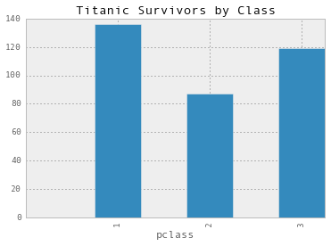

    # Combine multiple groups and plot
    titanic.groupby(['sex','pclass']).survived.sum().plot(kind='barh',title='Titanic Survivors by Class and Gender')

    <matplotlib.axes._subplots.AxesSubplot at 0x10813e110>

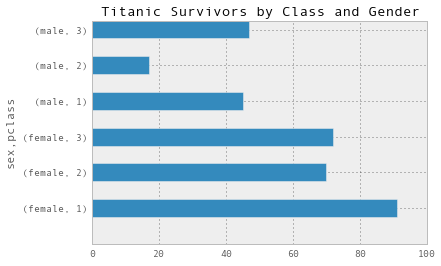

    # Histogram of a particular column
    titanic.fare.hist(grid=False,bins=25,range=(0,50))

    <matplotlib.axes._subplots.AxesSubplot at 0x10de3ff50>

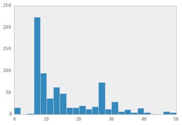

    pd.DataFrame.plot?

    # Density plot -- Estimate the 'true' distribution
    titanic.fare.dropna().plot(kind='kde', xlim=(0,100))

    <matplotlib.axes._subplots.AxesSubplot at 0x10dfdc650>

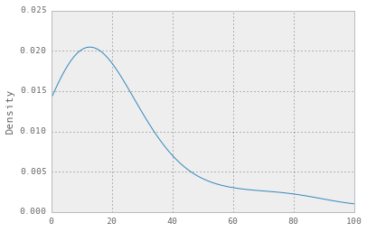

    titanic.fare.hist(bins=25, normed=True, color='lightseagreen')

    <matplotlib.axes._subplots.AxesSubplot at 0x10793d650>

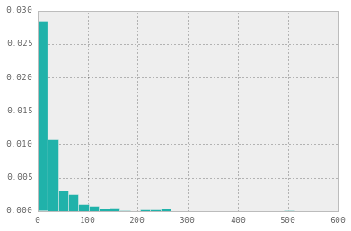

    titanic.fare.plot(kind='kde', xlim=(0,600), style='r--')

    <matplotlib.axes._subplots.AxesSubplot at 0x1078fa8d0>

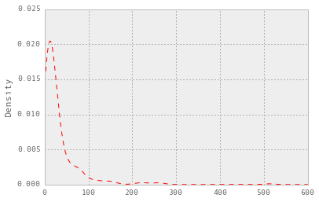

    titanic.boxplot(column='fare',by='pclass',grid=False)

    <matplotlib.axes._subplots.AxesSubplot at 0x108b75a10>

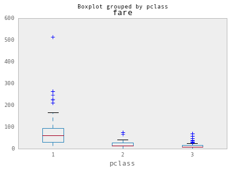

    # Combine pandas plots by running them together -- if pandas thinks they can be overlapped, it will
    titanic.fare.hist(bins=25, normed=True, color='lightseagreen')
    titanic.fare.plot(kind='kde', xlim=(0,100), style='r--')

    ax = titanic.boxplot(column='fare',by='pclass',grid=False)
    ax.set_ylim(0,50)

    (0, 50)

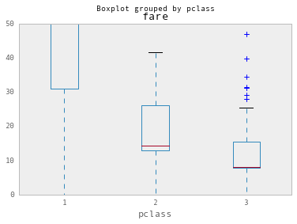

    # Combine pandas with matplotlib for scatterplots
    baseball = pd.read_csv("data/baseball.csv")
    #Offensive Statistics from MLB -- 2008.  Glossary: http://www.baseballprospectus.com/glossary/index.php?context=all&category=true
    
    baseball.head()

<table border="1" class="dataframe">
  <thead>
    <tr style="text-align: right;">
      <th></th>
      <th>id</th>
      <th>player</th>
      <th>year</th>
      <th>stint</th>
      <th>team</th>
      <th>lg</th>
      <th>g</th>
      <th>ab</th>
      <th>r</th>
      <th>h</th>
      <th>...</th>
      <th>rbi</th>
      <th>sb</th>
      <th>cs</th>
      <th>bb</th>
      <th>so</th>
      <th>ibb</th>
      <th>hbp</th>
      <th>sh</th>
      <th>sf</th>
      <th>gidp</th>
    </tr>
  </thead>
  <tbody>
    <tr>
      <th>0</th>
      <td> 88641</td>
      <td> womacto01</td>
      <td> 2006</td>
      <td> 2</td>
      <td> CHN</td>
      <td> NL</td>
      <td> 19</td>
      <td> 50</td>
      <td> 6</td>
      <td> 14</td>
      <td>...</td>
      <td> 2</td>
      <td> 1</td>
      <td> 1</td>
      <td> 4</td>
      <td> 4</td>
      <td> 0</td>
      <td> 0</td>
      <td> 3</td>
      <td> 0</td>
      <td> 0</td>
    </tr>
    <tr>
      <th>1</th>
      <td> 88643</td>
      <td> schilcu01</td>
      <td> 2006</td>
      <td> 1</td>
      <td> BOS</td>
      <td> AL</td>
      <td> 31</td>
      <td>  2</td>
      <td> 0</td>
      <td>  1</td>
      <td>...</td>
      <td> 0</td>
      <td> 0</td>
      <td> 0</td>
      <td> 0</td>
      <td> 1</td>
      <td> 0</td>
      <td> 0</td>
      <td> 0</td>
      <td> 0</td>
      <td> 0</td>
    </tr>
    <tr>
      <th>2</th>
      <td> 88645</td>
      <td> myersmi01</td>
      <td> 2006</td>
      <td> 1</td>
      <td> NYA</td>
      <td> AL</td>
      <td> 62</td>
      <td>  0</td>
      <td> 0</td>
      <td>  0</td>
      <td>...</td>
      <td> 0</td>
      <td> 0</td>
      <td> 0</td>
      <td> 0</td>
      <td> 0</td>
      <td> 0</td>
      <td> 0</td>
      <td> 0</td>
      <td> 0</td>
      <td> 0</td>
    </tr>
    <tr>
      <th>3</th>
      <td> 88649</td>
      <td> helliri01</td>
      <td> 2006</td>
      <td> 1</td>
      <td> MIL</td>
      <td> NL</td>
      <td> 20</td>
      <td>  3</td>
      <td> 0</td>
      <td>  0</td>
      <td>...</td>
      <td> 0</td>
      <td> 0</td>
      <td> 0</td>
      <td> 0</td>
      <td> 2</td>
      <td> 0</td>
      <td> 0</td>
      <td> 0</td>
      <td> 0</td>
      <td> 0</td>
    </tr>
    <tr>
      <th>4</th>
      <td> 88650</td>
      <td> johnsra05</td>
      <td> 2006</td>
      <td> 1</td>
      <td> NYA</td>
      <td> AL</td>
      <td> 33</td>
      <td>  6</td>
      <td> 0</td>
      <td>  1</td>
      <td>...</td>
      <td> 0</td>
      <td> 0</td>
      <td> 0</td>
      <td> 0</td>
      <td> 4</td>
      <td> 0</td>
      <td> 0</td>
      <td> 0</td>
      <td> 0</td>
      <td> 0</td>
    </tr>
  </tbody>
</table>

5 rows × 23 columns

    

    fig = plt.figure()
    ax = fig.add_subplot(1,1,1) # one row, one column, first plot
    ax.set_title("Hits vs. At Bats")
    ax.set_xlabel("At Bats")
    ax.set_ylabel("Hits")
    ax.scatter(baseball.ab, baseball.h) 

    <matplotlib.collections.PathCollection at 0x109e4d090>

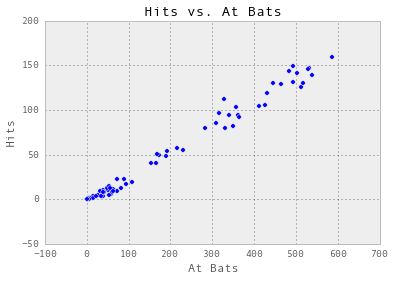

    fig = plt.figure()
    ax = fig.add_subplot(1,1,1) # one row, one column, first plot
    ax.set_title("At Bats vs. Hits.  Size = Home Runs")
    ax.set_xlabel("At Bats")
    ax.set_ylabel("Hits")
    plt.scatter(baseball.ab, baseball.h, s=baseball.hr*10, alpha=0.5)
    xlim(0, 700); ylim(0, 200)

    (0, 200)

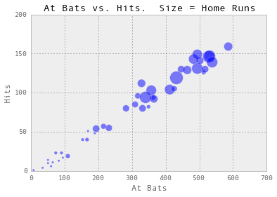

### Scatter matrix

    cols=['hr','h','r','rbi','ab']
    pd.scatter_matrix(baseball[cols])

    array([[<matplotlib.axes._subplots.AxesSubplot object at 0x109d1ec90>,
            <matplotlib.axes._subplots.AxesSubplot object at 0x10aa15410>,
            <matplotlib.axes._subplots.AxesSubplot object at 0x10aa9a150>,
            <matplotlib.axes._subplots.AxesSubplot object at 0x10aafa610>,
            <matplotlib.axes._subplots.AxesSubplot object at 0x10ac7d7d0>],
           [<matplotlib.axes._subplots.AxesSubplot object at 0x10ac34410>,
            <matplotlib.axes._subplots.AxesSubplot object at 0x10ad6f150>,
            <matplotlib.axes._subplots.AxesSubplot object at 0x10adf4310>,
            <matplotlib.axes._subplots.AxesSubplot object at 0x10ae57510>,
            <matplotlib.axes._subplots.AxesSubplot object at 0x10aed97d0>],
           [<matplotlib.axes._subplots.AxesSubplot object at 0x10af28e90>,
            <matplotlib.axes._subplots.AxesSubplot object at 0x10afc1190>,
            <matplotlib.axes._subplots.AxesSubplot object at 0x10b136f10>,
            <matplotlib.axes._subplots.AxesSubplot object at 0x10b1a6910>,
            <matplotlib.axes._subplots.AxesSubplot object at 0x10b32cbd0>],
           [<matplotlib.axes._subplots.AxesSubplot object at 0x10b391610>,
            <matplotlib.axes._subplots.AxesSubplot object at 0x10b4158d0>,
            <matplotlib.axes._subplots.AxesSubplot object at 0x10b3ca6d0>,
            <matplotlib.axes._subplots.AxesSubplot object at 0x108836710>,
            <matplotlib.axes._subplots.AxesSubplot object at 0x10b493110>],
           [<matplotlib.axes._subplots.AxesSubplot object at 0x1088abb50>,
            <matplotlib.axes._subplots.AxesSubplot object at 0x10b528e10>,
            <matplotlib.axes._subplots.AxesSubplot object at 0x10b4e1ad0>,
            <matplotlib.axes._subplots.AxesSubplot object at 0x10b61c690>,
            <matplotlib.axes._subplots.AxesSubplot object at 0x10b6a0850>]], dtype=object)

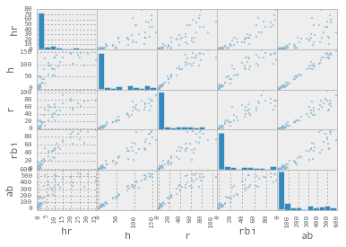

    

### Assignment

** A. Basic Plots** (required)
* Create an original histogram, lineplot, scatterplot, and scattermatrix from
your data
* If you cannot create one of the four plots due to the data, explain why
* Include multiple variables on one or many charts
* Clearly label all axes
* Make sure each graph is clearly labelled

** B. Advanced Plots**
* Create a trellis plot from a dataset.  Explain the benefits of the trellis
plot view.
* Import Seaborn (or bokeh or vincent) and recreate your initial exploratory
charts

** C. Highly Advanced** (optional)
* Recreate the [finanial chart](http://matplotlib.org/users/screenshots.html
#financial-charts) from the mpl demo.  See how far you can get.  You'll learn a
tremendous amount on the nuances of MPL in each stage.

    

    

    
