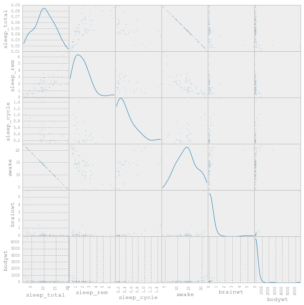
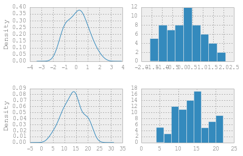
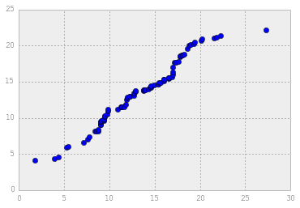
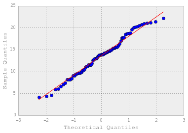
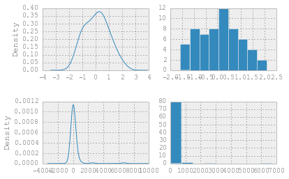
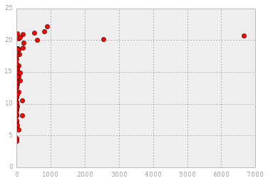
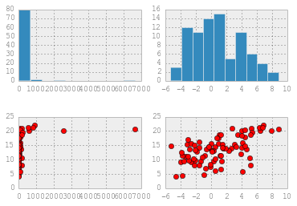
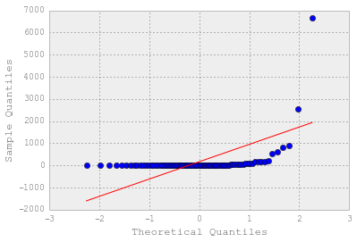
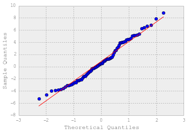
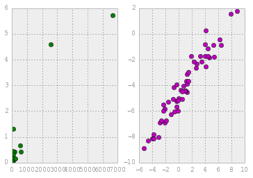

# Experimental Design Part 2: Handling Data Results

In today's class, we'll tackle:

* How to analyze the distributions in your data with scatterplots and histograms
* How to use data relationships to get results
* Interepretation of statsmodels coefficient tables

##Understanding distributions

Load in the following data set about mammals and their sleeping patterns. The
columns of the dataset are defined as followed:

* name: common name
* genus
* vore: carnivore, omnivore or herbivore?
* order
* conservation: the conservation status of the animal
* sleep_total: total amount of sleep, in hours
* sleep_rem: rem sleep, in hours
* sleep_cycle: length of sleep cycle, in hours
* awake: amount of time spent awake, in hours
* brainwt: brain weight in kilograms
* bodywt: body weight in kilograms

    import numpy as np
    import pandas as pd
    from pandas.tools.plotting import scatter_matrix
    from matplotlib import pyplot as plt
    
    pd.options.display.mpl_style = 'default'
    spat = pd.read_csv('./data/msleep.csv')
    
    print scatter_matrix(spat, figsize=[10, 10], alpha=0.2, diagonal='kde')
    spat.describe()

<table border="1" class="dataframe">
  <thead>
    <tr style="text-align: right;">
      <th></th>
      <th>sleep_total</th>
      <th>sleep_rem</th>
      <th>sleep_cycle</th>
      <th>awake</th>
      <th>brainwt</th>
      <th>bodywt</th>
    </tr>
  </thead>
  <tbody>
    <tr>
      <th>count</th>
      <td> 83.000000</td>
      <td> 61.000000</td>
      <td> 32.000000</td>
      <td> 83.000000</td>
      <td> 56.000000</td>
      <td>   83.000000</td>
    </tr>
    <tr>
      <th>mean</th>
      <td> 10.433735</td>
      <td>  1.875410</td>
      <td>  0.439583</td>
      <td> 13.567470</td>
      <td>  0.281581</td>
      <td>  166.136349</td>
    </tr>
    <tr>
      <th>std</th>
      <td>  4.450357</td>
      <td>  1.298288</td>
      <td>  0.358680</td>
      <td>  4.452085</td>
      <td>  0.976414</td>
      <td>  786.839732</td>
    </tr>
    <tr>
      <th>min</th>
      <td>  1.900000</td>
      <td>  0.100000</td>
      <td>  0.116667</td>
      <td>  4.100000</td>
      <td>  0.000140</td>
      <td>    0.005000</td>
    </tr>
    <tr>
      <th>25%</th>
      <td>  7.850000</td>
      <td>  0.900000</td>
      <td>  0.183333</td>
      <td> 10.250000</td>
      <td>  0.002900</td>
      <td>    0.174000</td>
    </tr>
    <tr>
      <th>50%</th>
      <td> 10.100000</td>
      <td>  1.500000</td>
      <td>  0.333333</td>
      <td> 13.900000</td>
      <td>  0.012400</td>
      <td>    1.670000</td>
    </tr>
    <tr>
      <th>75%</th>
      <td> 13.750000</td>
      <td>  2.400000</td>
      <td>  0.579167</td>
      <td> 16.150000</td>
      <td>  0.125500</td>
      <td>   41.750000</td>
    </tr>
    <tr>
      <th>max</th>
      <td> 19.900000</td>
      <td>  6.600000</td>
      <td>  1.500000</td>
      <td> 22.100000</td>
      <td>  5.712000</td>
      <td> 6654.000000</td>
    </tr>
  </tbody>
</table>

Already from quickly scanning the KDE (kernel density estimation) plots, we
recognize a few interesting relationships. KDE, like histograms, allow us to
quickly visualization the distribution of our data.

### Normal distributions

    norm = pd.DataFrame({'d': np.random.normal(size=60)})
    n_bins = np.abs(spat['awake'].max() - spat['awake'].min())
    fig, axes = plt.subplots(nrows=2, ncols=2,)
    
    norm['d'].plot(ax=axes[0, 0], kind='kde')
    norm['d'].hist(ax=axes[0, 1], bins=n_bins/2)
    spat['awake'].plot(ax=axes[1, 0], kind='kde')
    spat['awake'].hist(ax=axes[1, 1], bins=n_bins/2)
    
    print fig

    Figure(480x320)

Normal distributions are defined by their mean and standard deviation. We
primary use them in data science as it's often described as a natural state, but
also because it's easy to understand and calculate.

Above, it appears that the awake hours (or sleeping hours, as that is 24 - awake
hours) seems to fit pretty close to a normal distribution---but how close?

    qq = sorted(np.random.normal(spat['awake'].mean(), spat['awake'].std(), len(spat)))
    awake = sorted(spat['awake'])
    
    plt.plot(qq, awake, 'bo')
    plt.show()

Above, we're looking at a "qq plot." QQ plots are a way to determine how much
your data is similar to a probability distribution. However, doing it the above
way is obtrusive and obfuscates what we're handling.

Statsmodels, a statistical library in python, can curate these very quickly for
us.

    import statsmodels.api as sm
    import scipy.stats as stats
    
    # Check sm.qqplot() configurations with shift+tab to see how you can change the distribution you are testing against!
    fig = sm.qqplot(spat['awake'], dist=stats.distributions.norm, line='s')
    plt.show()

Our interpretation of the above plot would suggest a couple things:

* this data set's "awake" variable does pretty well fitting to a normal
distribution
* the missing normalcy occurs around 20 hours of sleep--which is similar to the
"hump" we saw in the histogram/KDE.

## Your turn

Walking through the same steps, verify the distribution for "sleep_rem". How
would you explain the shape of the data to someone else?

## Heavy tail distributions and power laws

Notice in the data set above, body weight and brain weight are not normally
distributed.

    fig, axes = plt.subplots(nrows=2, ncols=2,)
    
    norm['d'].plot(ax=axes[0, 0], kind='kde')
    norm['d'].hist(ax=axes[0, 1], bins=n_bins/2)
    spat['bodywt'].plot(ax=axes[1, 0], kind='kde')
    spat['bodywt'].hist(ax=axes[1, 1], bins=n_bins/2)

    <matplotlib.axes.AxesSubplot at 0x10f86d710>

    plt.plot(spat.bodywt, spat.awake, 'ro')
    # Clearly there isn't a linear relationship here.

    [<matplotlib.lines.Line2D at 0x10ef6ea50>]

One way to handle heavy tail data is with a linear transformation, such as a
power law.

Transposing the body weight using log manipulates the data into a shape we
better understand.

    fig, ax = plt.subplots(nrows=2, ncols=2,)
    
    ax[0, 0].hist(spat.bodywt)
    ax[0, 1].hist(np.log(spat.bodywt))
    ax[1, 0].plot(spat.bodywt, spat.awake, 'ro')
    ax[1, 1].plot(np.log(spat.bodywt), spat.awake, 'ro')
    
    plt.show()

    fig = sm.qqplot(spat['bodywt'], dist=stats.distributions.norm, line='s')
    plt.show()
    
    fig = sm.qqplot(np.log(spat['bodywt']), dist=stats.distributions.norm, line='s')
    plt.show()

Keep in mind that transforming data into some other "space" doesn't mean it's
[right](http://vserver1.cscs.lsa.umich.edu/~crshalizi/weblog/491.html)!

## Understanding how good the relationship is

We can also test the relationship between variables given it's statistical
significance. A p-value is the probability that a correllation is due to
randomness, or by chance. A low p-value means that the result is not due to
randomness, while a high p-value means it is due to randomness.

In statsmodels, we can use a coefficient table from the linear model to get our
p-values. To start, observe the relationship between body mass and brain mass in
the data set.

    import statsmodels.formula.api as smf
    # OLS, or ordinary least squares, takes a y (dependent variable) and X (independent variables) (formula = y ~ X)
    # Below, we copy the data frame and remove the na variables, and create a single variable linear model
    # to return a test statistic and p-value, to see how strong of a relationship bodyweight and brainweight have.
    
    spat_cleaned_up = pd.DataFrame(spat)
    spat_cleaned_up['bodywt'].dropna(inplace=True)
    spat_cleaned_up['brainwt'].dropna(inplace=True)
    spat_cleaned_up['log_bodywt'] = np.log(spat_cleaned_up['bodywt'])
    spat_cleaned_up['log_brainwt'] = np.log(spat_cleaned_up['brainwt'])
    
    fig, axes = plt.subplots(nrows=1,ncols=2)
    
    axes[0].plot(spat_cleaned_up.bodywt, spat_cleaned_up.brainwt, 'go')
    
    model = smf.ols(formula='brainwt ~ bodywt', data=spat_cleaned_up)
    results = model.fit()
    print 'NORMAL FIT SUMMARY'
    print(results.summary())
    print
    
    axes[1].plot(spat_cleaned_up.log_bodywt, spat_cleaned_up.log_brainwt, 'mo')
    
    log_model = smf.ols(formula='log_brainwt ~ log_bodywt', data=spat_cleaned_up)
    log_results = log_model.fit()
    print 'LOG-LOG FIT SUMMARY'
    print(log_results.summary())
    
    print fig

    NORMAL FIT SUMMARY
                                OLS Regression Results                            
    ==============================================================================
    Dep. Variable:                brainwt   R-squared:                       0.872
    Model:                            OLS   Adj. R-squared:                  0.870
    Method:                 Least Squares   F-statistic:                     367.7
    Date:                Sun, 28 Sep 2014   Prob (F-statistic):           9.16e-26
    Time:                        20:11:14   Log-Likelihood:                -20.070
    No. Observations:                  56   AIC:                             44.14
    Df Residuals:                      54   BIC:                             48.19
    Df Model:                           1                                         
    ==============================================================================
                     coef    std err          t      P>|t|      [95.0% Conf. Int.]
    ------------------------------------------------------------------------------
    Intercept      0.0859      0.048      1.782      0.080        -0.011     0.183
    bodywt         0.0010   5.03e-05     19.176      0.000         0.001     0.001
    ==============================================================================
    Omnibus:                       85.068   Durbin-Watson:                   2.376
    Prob(Omnibus):                  0.000   Jarque-Bera (JB):             1330.630
    Skew:                           4.258   Prob(JB):                    1.14e-289
    Kurtosis:                      25.311   Cond. No.                         981.
    ==============================================================================
    
    LOG-LOG FIT SUMMARY
                                OLS Regression Results                            
    ==============================================================================
    Dep. Variable:            log_brainwt   R-squared:                       0.932
    Model:                            OLS   Adj. R-squared:                  0.931
    Method:                 Least Squares   F-statistic:                     738.4
    Date:                Sun, 28 Sep 2014   Prob (F-statistic):           3.56e-33
    Time:                        20:11:14   Log-Likelihood:                -55.688
    No. Observations:                  56   AIC:                             115.4
    Df Residuals:                      54   BIC:                             119.4
    Df Model:                           1                                         
    ==============================================================================
                     coef    std err          t      P>|t|      [95.0% Conf. Int.]
    ------------------------------------------------------------------------------
    Intercept     -4.7754      0.093    -51.463      0.000        -4.961    -4.589
    log_bodywt     0.7652      0.028     27.173      0.000         0.709     0.822
    ==============================================================================
    Omnibus:                        4.775   Durbin-Watson:                   2.240
    Prob(Omnibus):                  0.092   Jarque-Bera (JB):                4.060
    Skew:                           0.653   Prob(JB):                        0.131
    Kurtosis:                       3.193   Cond. No.                         3.46
    ==============================================================================
    Figure(480x320)

Words/parts of the table we should know and understand (for now):

* **`P>|t|`** : p values. In both cases we see significance in the relationship,
but not with where the predicted y value starts
* **`t`** : t-value of the coefficients (which we'll talk about more next week).
It's used to determine the p-values
* **`F-statistic`** and **`P (F-statistic)`** : A comparison of this how this
data fits vs the same data set with less information. like the p-values above,
the closer the f-statisitics p-value is to 0, the better this "fit"
* **`R-squared`**, which is not a value of R (correlation) ^2, is a
representation of "goodness of fit." For now, understand this as a value that
primarily ranges between 0 and 1, 1 being the "best" fit.

Even though in both instances the p-value of the body weight is significant (p ~
0), it's important to note that:

* The "goodness of fit" in the log-log transform is higher than the non-
transformed version
* A scatter plot of each confirms that the relationship is a lot easier on the
eyes as well in the log-log transform

Therefore it's incredibly useful to work with both **visualizations** and
**using models** to understand data relationships.

Note that you can also get much of this information in an analysis of variance
table (see below code), or further evaluate at a per-point basis.

    print sm.stats.anova_lm(log_results, typ=2)
    print
    print log_results.get_influence().summary_table()

                    sum_sq  df           F        PR(>F)
    log_bodywt  327.602483   1  738.388555  3.562822e-33
    Residual     23.958299  54         NaN           NaN
    
    ==================================================================================================
           obs      endog     fitted     Cook's   student.   hat diag    dffits   ext.stud.     dffits
                               value          d   residual              internal   residual           
    --------------------------------------------------------------------------------------------------
             0     -4.167     -5.337      0.037      1.777      0.023      0.272      1.814      0.277
             1     -8.146     -7.808      0.009     -0.523      0.061     -0.133     -0.519     -0.132
             2     -0.860      0.119      0.089     -1.526      0.071     -0.423     -1.546     -0.428
             3     -2.659     -2.756      0.000      0.147      0.023      0.023      0.146      0.022
             4     -2.321     -2.714      0.004      0.597      0.023      0.092      0.593      0.092
             5     -2.163     -2.089      0.000     -0.113      0.030     -0.020     -0.112     -0.020
             6     -5.203     -5.018      0.001     -0.280      0.021     -0.041     -0.278     -0.040
             7     -5.051     -5.439      0.004      0.589      0.024      0.092      0.586      0.091
             8     -6.908     -6.928      0.000      0.031      0.043      0.007      0.031      0.007
             9     -5.021     -4.775      0.001     -0.372      0.019     -0.052     -0.369     -0.052
            10     -8.874     -8.829      0.000     -0.070      0.087     -0.022     -0.069     -0.021
            11     -4.528     -3.817      0.011     -1.078      0.018     -0.146     -1.079     -0.146
            12     -4.398     -3.948      0.004     -0.682      0.018     -0.092     -0.679     -0.092
            13     -5.067     -4.369      0.010     -1.057      0.018     -0.144     -1.058     -0.144
            14      1.527      1.226      0.013      0.478      0.103      0.162      0.474      0.161
            15     -8.112     -7.662      0.015     -0.696      0.057     -0.172     -0.692     -0.171
            16     -0.423      0.011      0.017     -0.676      0.069     -0.183     -0.672     -0.182
            17     -0.870     -0.773      0.001     -0.150      0.051     -0.035     -0.148     -0.034
            18     -5.655     -4.975      0.011     -1.031      0.020     -0.149     -1.031     -0.149
            19     -2.163     -3.014      0.018      1.291      0.021      0.190      1.299      0.191
            20     -3.665     -3.862      0.001      0.298      0.018      0.040      0.295      0.040
            21     -5.298     -6.007      0.018      1.080      0.029      0.188      1.081      0.188
            22     -1.124     -1.376      0.003      0.386      0.040      0.079      0.383      0.078
            23     -4.401     -4.037      0.003     -0.551      0.018     -0.074     -0.547     -0.074
            24      0.278     -1.617      0.157      2.898      0.036      0.561      3.124      0.605
            25      1.743      1.960      0.009     -0.350      0.129     -0.135     -0.347     -0.133
            26     -1.720     -3.309      0.058      2.408      0.020      0.340      2.525      0.357
            27     -6.908     -6.398      0.011     -0.779      0.034     -0.147     -0.776     -0.147
            28     -7.824     -7.696      0.001     -0.198      0.058     -0.049     -0.197     -0.049
            29     -8.294     -8.299      0.000      0.008      0.073      0.002      0.008      0.002
            30     -4.382     -4.518      0.000      0.206      0.018      0.028      0.204      0.028
            31     -4.415     -4.074      0.002     -0.515      0.018     -0.070     -0.512     -0.069
            32     -1.743     -1.702      0.000     -0.062      0.035     -0.012     -0.062     -0.012
            33     -0.821     -1.749      0.036      1.418      0.034      0.267      1.432      0.269
            34     -1.852     -1.252      0.019     -0.920      0.042     -0.193     -0.919     -0.192
            35     -1.715     -2.305      0.011      0.899      0.027      0.151      0.897      0.150
            36     -6.032     -5.233      0.017     -1.214      0.022     -0.182     -1.219     -0.183
            37     -4.474     -4.406      0.000     -0.103      0.018     -0.014     -0.102     -0.014
            38     -2.513     -1.643      0.033     -1.331      0.036     -0.256     -1.341     -0.258
            39     -3.863     -3.795      0.000     -0.103      0.018     -0.014     -0.102     -0.014
            40     -6.266     -5.647      0.012     -0.941      0.026     -0.152     -0.940     -0.152
            41     -3.912     -5.003      0.029      1.655      0.021      0.240      1.682      0.244
            42     -6.725     -6.757      0.000      0.049      0.040      0.010      0.048      0.010
            43     -6.742     -6.237      0.010     -0.771      0.032     -0.141     -0.768     -0.140
            44     -5.809     -6.385      0.014      0.880      0.034      0.166      0.878      0.166
            45     -5.167     -4.839      0.002     -0.497      0.020     -0.071     -0.494     -0.070
            46     -5.521     -6.530      0.045      1.542      0.036      0.300      1.562      0.304
            47     -8.016     -7.099      0.048     -1.410      0.046     -0.310     -1.424     -0.313
            48     -1.715     -1.365      0.006     -0.536      0.040     -0.110     -0.533     -0.109
            49     -3.689     -3.625      0.000     -0.097      0.018     -0.013     -0.097     -0.013
            50     -1.778     -0.693      0.078     -1.673      0.053     -0.394     -1.702     -0.401
            51     -5.952     -4.856      0.028     -1.662      0.020     -0.236     -1.691     -0.240
            52     -5.991     -6.507      0.012      0.789      0.036      0.153      0.786      0.152
            53     -4.046     -4.245      0.001      0.302      0.018      0.041      0.300      0.041
            54     -3.112     -3.844      0.011      1.108      0.018      0.150      1.110      0.150
            55     -2.988     -3.672      0.010      1.037      0.018      0.142      1.037      0.142
    ==================================================================================================

## Next Steps (work submission)

**Are animal sleep patterns dependent on their weight?**

We want to test the relationships between the hours of sleep_rem or sleep_cycle
an animal gets, and either body weight or brain weight. Repeat the steps above
in one or two cells to show:

1. Is there a linear relationship between one of these variables and the number
of hours?
2. If so, what's the measure of goodness of fit?
3. Does one seem to fit better than another?

By practicing:

* creating histograms, scatterplots, and qqplots
* fitting a single variable linear model
* reading and interpreting the returning summary table

**ADVANCED**

There are missing values all over the data set. Which variables seem easy to
interpolate? Include your code.

## Further next steps / more practice

The following data sets have been explored, or at least included, in our work so
far:

* `/06_eda/imdb_top_10000`
* `/06_eda/movies_version01.csv`
* `/05_Data_Visualization/data/cars.csv`
* `/05_Data_Visualization/data/citybike_feb2014.csv`
* `/05_Data_Visualization/data/titanic.csv`

In a similar vein, explore the relationships with variables, after determining a
dependent variable, y.

# Next Class

Presentations will be next class in small groups. One person from each group
will be voted to share their work with the entire class.

Presentations are expected to be 2-3 minutes in length, with 2 minutes time for
questions. We will time it on Wednesday, as well as explain in more detail about
how the process will function, as we'll be doing this process a couple times
throughout the course.

We are *not* expecting (or wanting!) a powerpoint. Powerpoint is fluff when you
have everything in your ipython notebook!

**DO** take the time to organize your ipython notebook and make the presentation
of it as clear as possible. In fact, consider it your powerpoint, so treat it as
such!
